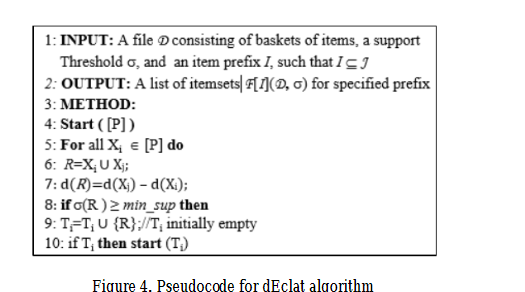

## dEclat Description

The diffset format (the difference of two sets) has drastically reduced the running time and memory usage of the Eclat algorithm and the Eclat algorithm using diffset format is called dEclat algorithm 
thus dEclat algorithm is more efficient variation of the Eclat algorithm.
Both mentioned algorithms are used for discovering frequent itemsets in a transactional database.
The main difference, between this two algorithms, is a structure which is implemented on top of them.
dEclat uses "difflists" to represent differential lists of transaction identifiers, 
which means that it stores information about transactions which are not present in the set.

This algorithm requires two input parameters: 
- data in the form of "transactions" and 
- minimal support (minSupp) parameter 

which indicates a threshold of acceptance. 

In simplified terms, we can say that this algorithm is all about computing the support of the itemsets 
and comparing with minSupp parameter.

As output, we expect a group of items, which are called "frequents itemsets". 

A group of items is frequent when they are present together in at least "minSupp + 1" transactions- which means that their support is grater than minSupp parameter.

The limitations of the algorithm are that the items in transactions are assumed to be sorted by lexicographical order 
and each transaction in a set is unique- there are no duplicate transactions in a single itemset.

It is neither the only, nor the best algorithm to find frequent itemsets, but it is definitely one of the best. 
The advantage of dEclat is due to vertical representation of the data - it uses Depth first search for discovering frequent itemsets.

The most important advantage of dEclat algorithm is that it's faster than many of other algorithms and at the same time needs less memory
comparing with e.g. Apriori or Eclat algorithms.

Looking at disadvantages, we may point out, that dEclat algorithm is suitable for a dense database, but degrades with spare database, 
and it needs to switch between tidset and diffset for a sparse database

## Pseudo code

## References

- [philippe-fournier-viger](https://www.philippe-fournier-viger.com/spmf/Eclat_dEclat.php)
- [i2tutorials](https://www.i2tutorials.com/machine-learning-tutorial/eclat-algorithm/)
- [researchgate](https://www.researchgate.net/publication/337664313_Frequent_itemset_mining_technique_to_improve_eclat_based_algorithm)